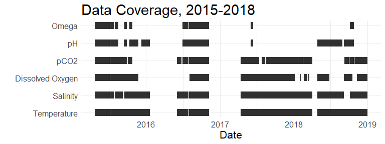
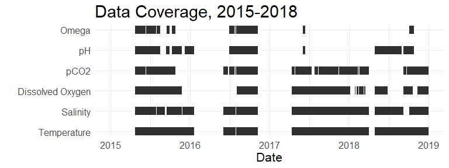

Data Coverage Graphic
================
Curtis C. Bohlen

  - [Load Libraries](#load-libraries)
  - [Load Data](#load-data)
      - [Establish Folder References](#establish-folder-references)
      - [Load The Data](#load-the-data)
  - [Data Coverage Chart](#data-coverage-chart)
      - [Organize Data](#organize-data)
      - [Draft Coverage Chart](#draft-coverage-chart)
      - [Final Graphic](#final-graphic)
  - [Total Number of Days Each Sensor was
    Operational](#total-number-of-days-each-sensor-was-operational)

# Load Libraries

``` r
library(tidyverse)
```

    ## -- Attaching packages ----------------------------------------------------------------------------------- tidyverse 1.3.0 --

    ## v ggplot2 3.3.2     v purrr   0.3.4
    ## v tibble  3.0.1     v dplyr   1.0.0
    ## v tidyr   1.1.0     v stringr 1.4.0
    ## v readr   1.3.1     v forcats 0.5.0

    ## -- Conflicts -------------------------------------------------------------------------------------- tidyverse_conflicts() --
    ## x dplyr::filter() masks stats::filter()
    ## x dplyr::lag()    masks stats::lag()

``` r
library(readr)

library(CBEPgraphics)

load_cbep_fonts()
```

# Load Data

## Establish Folder References

``` r
sibfldnm <- 'Derived_Data'
parent   <- dirname(getwd())
sibling  <- file.path(parent,sibfldnm)

fn    <- 'CascoBayOAData.csv'
fpath <- file.path(sibling,fn)
```

## Load The Data

The following loads existing data, including a “Temperature Adjusted”
pCO2 value based on Takehashi et al. 2002. It then collapses that data
to daily summaries.

``` r
all_data <- read_csv(fpath,
                     col_types = cols(dd = col_integer(), 
                                      doy = col_integer(),
                                      hh = col_integer(),
                                      mm = col_integer(),
                                      yyyy = col_integer())) %>%
  select(c(13, 1:4, 14, 5:6, 8, 7 ,16, 9:12))
```

# Data Coverage Chart

## Organize Data

By default, ggplot connects all points in sequence with geom\_line(). In
this context, that would incorrectly draw lines through periods of time
where data is unavailable. The function geom\_line can accept a “group”
aesthetic, which tells it to draw lines between points within groups
only. (Color aesthetics work similarly). So, we need to create a
dataframe in which we give contiguous groups of dates the same grop
signifier, and pass that to ggplot.

``` r
coverage <- all_data %>%
  mutate_at(7:13, ~! is.na(.)) %>%
  select(1:13) %>%
  gather(key = Parameter,  value =  Availability, 7:13, factor_key = FALSE) %>%
  filter(Availability)

dif <- c(1,diff(coverage$datetime, units = hours))  # Calculate first differences
d2 <- c(1, which(dif != 1), nrow(coverage)+1)       # Find indexes to all spots where the first difference is not one
                                                    # This produces a list of indexes to first observations after
                                                    # gaps in the data (or changes in which variable we are looking at).
coverage$grp <- rep(1:length(diff(d2)), diff(d2))   # diff(d2) here is the number of observations in each
                                                    # contiguous block of observations.  We assign each  group
                                                    # a number between 1 and the number of groups, and then
                                                    # assign every observation in that block that number as its
                                                    # group signifier.
```

## Draft Coverage Chart

``` r
labs <- c('Temperature', 'Salinity', 'Dissolved Oxygen', 'pCO2', 'pH', 'Omega')
plt<- coverage %>%
  filter(Parameter != 'co2_corr') %>%
  mutate(Parameter = factor(Parameter,
                            levels = c('temp', 'sal', 'do',
                                       'co2', 'ph', 'omega_a'),
                            labels = labs)) %>%

  ggplot(aes(datetime, as.numeric(Parameter), group = grp)) +
  geom_line(lwd = 5, color = cbep_colors()[3]) +
  xlab('Date') +
  ylab('') +
  scale_y_continuous(breaks = 1:6, minor_breaks = NULL, labels = labs) +
  theme_minimal() +
  #theme(panel.grid.major = element_blank(), panel.grid.minor = element_blank()) +
  ggtitle('Data Coverage, 2015-2018') +
  theme(axis.title = element_text(size = 16)) +
  theme(title = element_text(size = 18)) +
  theme(axis.text = element_text(size = 12))
plt
```

    ## Warning: Removed 4 row(s) containing missing values (geom_path).

<!-- -->

## Final Graphic

``` r
d1 = ISOdate(2015,1,1,tz='America/New_York')
d2 = ISOdate(2018,12,31,tz='America/New_York')
plt + xlim(c(d1,d2))
```

    ## Warning: Removed 48 row(s) containing missing values (geom_path).

<!-- -->

``` r
ggsave('datacoverage.png', width = 7, height = 5, type = 'cairo')
```

    ## Warning: Removed 48 row(s) containing missing values (geom_path).

``` r
ggsave('datacoverage.pdf', width = 7, height = 5, device = cairo_pdf)
```

    ## Warning: Removed 48 row(s) containing missing values (geom_path).

# Total Number of Days Each Sensor was Operational

The following code will generate boolean daily flags to show which
instruments were in operation for at least a portion of the day. We can
add those up to determine how many days each was operational.

``` r
dt <- as.POSIXlt(coverage$datetime)
tmp <- coverage %>%
  mutate(d = ISOdate(dt$year+1900, dt$mon +1, dt$mday, tz = 'America/New_York')) %>%
  filter(Parameter != 'co2_corr') %>%
  mutate(Parameter = factor(Parameter,
                            levels = c('temp', 'sal', 'do',
                                       'co2', 'ph', 'omega_a'))) %>%
  
  spread(key = Parameter, value = Availability) %>%
  group_by(d) %>%
    summarise(SeaBird = sum(temp, na.rm=TRUE)>0,
              Optode = sum(do, na.rm=TRUE)>0,
              SeaFET = sum(ph, na.rm=TRUE)>0,
              SAMI = sum(co2, na.rm=TRUE)>0,
              Calculations = sum(omega_a, na.rm=TRUE)>0)
```

    ## `summarise()` ungrouping output (override with `.groups` argument)

``` r
days = sapply(tmp[2:6], sum)
pct = round(100*days/(365*4+1),0)
knitr::kable(rbind(days, pct) )
```

|      | SeaBird | Optode | SeaFET | SAMI | Calculations |
| :--- | ------: | -----: | -----: | ---: | -----------: |
| days |    1035 |    801 |    545 |  797 |          312 |
| pct  |      71 |     55 |     37 |   55 |           21 |
